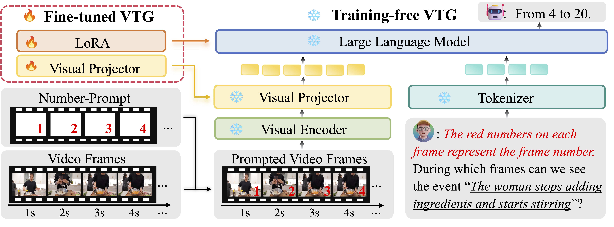

# [Preprint] Number it: Temporal Grounding Videos like Flipping Manga
This repository contains the PyTorch implementation for the paper [Number it: Temporal Grounding Videos like Flipping Manga](https://arxiv.org/abs/2411.10332).



Video Large Language Models (Vid-LLMs) excel in video comprehension but struggle with precise temporal localization. Introducing Number-Prompt (NumPro): a novel method that adds unique numerical identifiers to video frames, transforming Video Temporal Grounding (VTG) into an intuitive process similar to flipping through manga panels. This technique significantly enhances VTG performance without additional computational cost, achieving up to 6.9% improvement in mIoU for moment retrieval and 8.5% in mAP for highlight detection.

If you have any questions on this repository or the related paper, feel free to create an issue. All data corresponding to the paper will be updated at [Google Drive](https://drive.google.com/drive/folders/13NYRDC87Uc4AqaT5FBHA7QkHV5OMl-v8?usp=sharing).

## Get Started
```bash
git clone https://github.com/yongliangwu/NumPro.git
cd NumPro
conda create -n numpro python=3.10
conda activate numpro
pip install -r requirements.txt
```
## Data Preparation
### Download
To get started with the data, please follow these steps:

1. Download the video datasets from:
   - [Charades-STA](http://vuchallenge.org/charades.html)
   - [DiDeMo](https://github.com/LisaAnne/TemporalLanguageRelease) 
   - [ActivityNet](http://activity-net.org/download.html)
   - [QVHighlights](https://github.com/jayleicn/moment_detr)

2. Extract all downloaded datasets into the `data` folder.

3. Download our instruction dataset for training from [Google Drive](https://drive.google.com/file/d/1X4VSdSpGEBeRDVGaZq6HsUjJxUj88jDc/view?usp=sharing) and put it into `data` folder.

Note: Our training also incorporates instruction datasets from [VTimeLLM](https://github.com/huangb23/VTimeLLM) stages 2 and 3. Due to YouTube copyright restrictions, we are unable to directly distribute the source videos. However, you can download these videos yourself using [yt-dlp](https://github.com/yt-dlp/yt-dlp). If you encounter any difficulties or need help with this process, please don't hesitate to open an issue.

### Preprocess
For training NumPro-FT, we need to extract the frames from the videos at 0.5 FPS and add numbers to them. We provide the code for this process in the `preprocess` folder.
```bash
python preprocess/anet.py
python preprocess/didemo.py
python preprocess/internvid.py
```
Please make sure all the folder paths are set correctly.

## Training NumPro-FT
To begin, download the required model checkpoints and place them in the `pretrained` folder:
1. LongVA-7B-DPO model from [Hugging Face](https://huggingface.co/lmms-lab/LongVA-7B-DPO)
2. CLIP vision encoder from [OpenAI](https://huggingface.co/openai/clip-vit-large-patch14-336)

You can use the following commands to download them:

```bash
huggingface-cli download lmms-lab/LongVA-7B-DPO --local-dir ./pretrained/LongVA-7B-DPO
huggingface-cli download openai/clip-vit-large-patch14-336 --local-dir ./pretrained/clip-vit-large-patch14-336
```

Then, you can start training with the following command:
```bash
sh scripts/train.sh
```
Training requires approximately 35GB of GPU memory per device with batch size 1, and takes around 24 hours to complete 3 epochs when using 8 NVIDIA H800 GPUs.


## Inference
Please download the annotation files for testing from [Google Drive](https://drive.google.com/drive/folders/11tsL9BjM3xcyaYDN2Af-n6yJfmvWuggv?usp=sharing) and put them into `data` folder.
### NumPro-FT
Download the checkpoint from [Google Drive](https://drive.google.com/drive/folders/1klRwOTQNCU2EPzbA8qB_rMUwzVOFFHYV?usp=sharing) and put it into `checkpoints` folder.
#### Moment Retrieval
```bash
LORA_PATH="checkpoints/longva_7b_dpo_NumPro_FT"

python eval/numpro_ft_mr.py --lora_path $LORA_PATH
```
#### Highlight Detection
```bash
LORA_PATH="checkpoints/longva_7b_dpo_NumPro_FT"

python eval/numpro_ft_hd.py --lora_path $LORA_PATH
```
### NumPro
#### Moment Retrieval
```bash
python eval/qwen2_vl_7b_mr.py
```
#### Highlight Detection
```bash
python eval/qwen2_vl_7b_hd.py
```

### Evaluation
We provide the evaluation results of NumPro-FT through [Google Drive](https://drive.google.com/drive/folders/1SQT_jboYlEDvl_fJKbHBb4BOGZDH4YS3?usp=sharing) for reference and comparison.

Important Note: All results are processed at 0.5 frames per second (FPS). To convert to 1 FPS timestamps, simply multiply the frame numbers by 2.

For evaluation metrics and implementation details, please refer to the evaluation code from [TimeChat](https://github.com/RenShuhuai-Andy/TimeChat).

## Acknowledgement
Our implementation is based on the following repositories:

- https://github.com/huangb23/VTimeLLM
- https://github.com/RenShuhuai-Andy/TimeChat
- https://github.com/EvolvingLMMs-Lab/LongVA
- https://github.com/xiaoachen98/Open-LLaVA-NeXT
- https://github.com/LaBaZh/OpenLongVA

We thank the authors for their excellent works.
