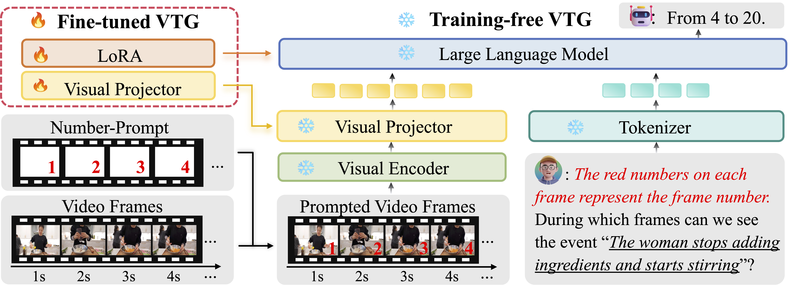

以下是您提供的英文内容的中文翻译：

# [预印本] 编号它：像翻阅漫画一样对视频进行时间定位
本仓库包含了论文 [编号它：像翻阅漫画一样对视频进行时间定位](https://arxiv.org/abs/2411.10332) 的 PyTorch 实现。



视频大型语言模型（Vid-LLMs）在视频理解方面表现出色，但在精确的时间定位上存在困难。引入编号提示（NumPro）：一种新颖的方法，它为视频帧添加独特的数字标识符，将视频时间定位（VTG）转变为类似于翻阅漫画面板的直观过程。这种技术显著提高了VTG性能，且无需额外的计算成本，对于时刻检索实现了高达6.9%的mIoU提升，对于高光检测实现了8.5%的mAP提升。

如果您对此仓库或相关论文有任何问题，欢迎创建一个issue。所有与论文相关的数据将在 [Google Drive](https://drive.google.com/drive/folders/13NYRDC87Uc4AqaT5FBHA7QkHV5OMl-v8?usp=sharing) 更新。

## 开始使用
```bash
git clone https://github.com/yongliangwu/NumPro.git 
cd NumPro
conda create -n numpro python=3.10
conda activate numpro
pip install -r requirements.txt
```

## 数据准备
### 下载
要开始处理数据，请按照以下步骤操作：

1. 从以下网站下载视频数据集：
   - [Charades-STA](http://vuchallenge.org/charades.html)               # 已下载
   - [DiDeMo](https://github.com/LisaAnne/TemporalLanguageRelease)      # 未下载
   - [ActivityNet](http://activity-net.org/download.html)               # 已下载
   - [QVHighlights](https://github.com/jayleicn/moment_detr)            # 已下载

2. 将所有下载的数据集解压到 `data` 文件夹中。

3. 从 [Google Drive](https://drive.google.com/file/d/1X4VSdSpGEBeRDVGaZq6HsUjJxUj88jDc/view?usp=sharing) 下载我们的指令数据集，用于训练，并将其放入 `data` 文件夹中。# 已下载

注意：我们的训练还结合了来自 [VTimeLLM](https://github.com/huangb23/VTimeLLM) 第二和第三阶段的指令数据集。由于YouTube版权限制，我们无法直接分发源视频。但是，您可以使用 [yt-dlp](https://github.com/yt-dlp/yt-dlp) 自行下载这些视频。如果您在此过程中遇到任何困难或需要帮助，请随时提出issue。

### 预处理
对于训练 NumPro-FT，我们需要以0.5 FPS的帧率从视频中提取帧，并在它们上面添加数字。我们在 `preprocess` 文件夹中提供了这个过程的代码。
```bash
python preprocess/anet.py       # 缺失 v1.2 文件
python preprocess/didemo.py     # 未下载
python preprocess/internvid.py  # 文件过大
```

请确保所有文件夹路径设置正确。

## 训练 NumPro-FT
首先，下载所需的模型检查点并将它们放置在 `pretrained` 文件夹中：
1. 从 [Hugging Face](https://huggingface.co/lmms-lab/LongVA-7B-DPO) 下载 LongVA-7B-DPO 模型。    # 已下载
2. 从 [OpenAI](https://huggingface.co/openai/clip-vit-large-patch14-336) 下载 CLIP 视觉编码器。  # 已下载

您可以使用以下命令下载它们：

```bash
huggingface-cli download lmms-lab/LongVA-7B-DPO --local-dir ./pretrained/LongVA-7B-DPO
huggingface-cli download openai/clip-vit-large-patch14-336 --local-dir ./pretrained/clip-vit-large-patch14-336
```

然后，您可以使用以下命令开始训练：# 缺失训练集
```bash
sh scripts/train.sh
```

训练大约需要每个设备35GB的GPU内存，批量大小为1，使用8个NVIDIA H800 GPU大约需要24小时才能完成3个epoch。

## 推理
请从 [Google Drive](https://drive.google.com/drive/folders/11tsL9BjM3xcyaYDN2Af-n6yJfmvWuggv?usp=sharing) 下载测试的注释文件，并将它们放入 `data` 文件夹中。  # 已下载
### NumPro-FT
从 [Google Drive](https://drive.google.com/drive/folders/1klRwOTQNCU2EPzbA8qB_rMUwzVOFFHYV?usp=sharing) 下载检查点，并将其放入 `checkpoints` 文件夹中。         # 已下载
#### 时刻检索
```bash
export NCCL_P2P_DISABLE=1
export NCCL_IB_DISABLE=1

LORA_PATH="checkpoints/longva_7b_dpo_NumPro_FT"

python eval/numpro_ft_mr.py --lora_path $LORA_PATH
```

#### 高光检测
```bash
LORA_PATH="checkpoints/longva_7b_dpo_NumPro_FT"

python eval/numpro_ft_hd.py --lora_path $LORA_PATH
```

### NumPro
#### 时刻检索
```bash
export NCCL_P2P_DISABLE=1
export NCCL_IB_DISABLE=1

export RANK=0
export WORLD_SIZE=1
export MASTER_ADDR=localhost
export MASTER_PORT=12345

python eval/qwen2_vl_7b_mr.py
```

#### 高光检测
```bash
python eval/qwen2_vl_7b_hd.py
```

### 评估
我们通过 [Google Drive](https://drive.google.com/drive/folders/1SQT_jboYlEDvl_fJKbHBb4BOGZDH4YS3?usp=sharing) 提供了 NumPro-FT 的评估结果，供参考和比较。

有关评估指标和实现细节，请参考 [TimeChat](https://github.com/RenShuhuai-Andy/TimeChat) 的评估代码。

重要提示：所有结果均以每秒0.5帧（FPS）处理。要转换为1 FPS的时间戳，只需将帧数乘以2。

## 致谢
我们的实现基于以下仓库：

- https://github.com/huangb23/VTimeLLM 
- https://github.com/RenShuhuai-Andy/TimeChat 
- https://github.com/EvolvingLMMs-Lab/LongVA 
- https://github.com/xiaoachen98/Open-LLaVA-NeXT 
- https://github.com/LaBaZh/OpenLongVA 

我们感谢作者们的优秀工作。
